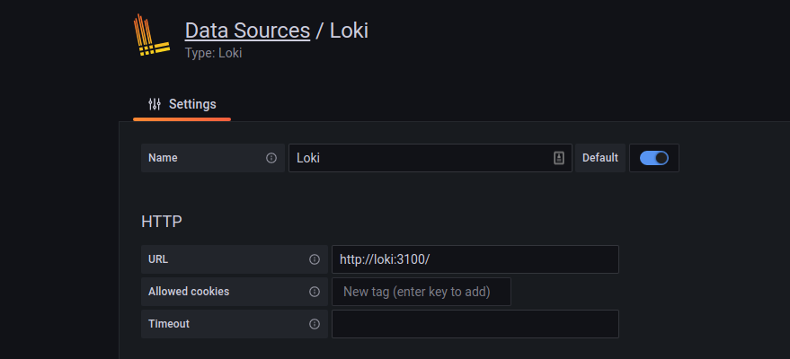
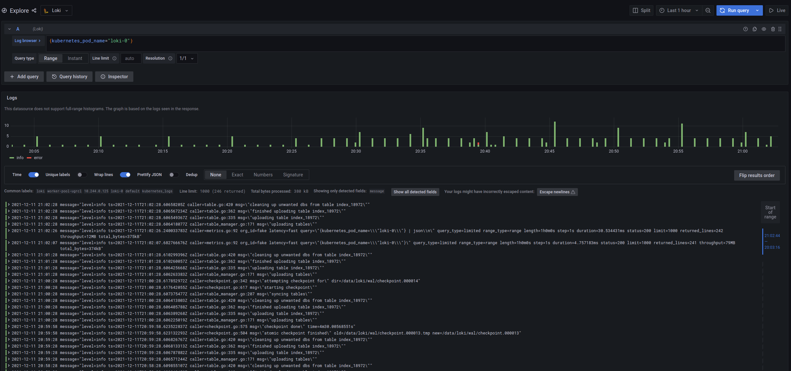

# Digital Ocean Kubernetes Challenge.

Deploying Loki and Grafana to a cluster and an agent to forward pod logs

## Deploying

This repo deploys a simple setup of:

* Loki - For log storage
* Grafana - For viewing and querying of logs stored in Loki
* Vector - As a log agent forwarding Pod logs to Loki

### Prerequisites

Export your Digital Ocean token
```shell
export DO_TOKEN="rklfagjiotjgo"
```
Create tfvars files so the Terraform provider knows the token
```
cat <<EOF | tee ./cluster_tf/token.auto.tfvars ./manifest_tf/token.auto.tfvars
do_token = "${DO_TOKEN}"
EOF
```

### Cluster setup

Run the terraform under `./cluster_tf` which will create a Digital Ocean Managed Kubernetes Cluster.
The kubeconfig for the cluster is an output so you can copy that to ~/.kube/config to access the cluster with `kubectl`.

Run with:
```shell
terraform init
terraform plan -out=out
```
Review the plan, then apply with
```
terraform apply out
```

You should now have a managed kubernetes cluster which costs ~$45/month

### Helm setup

Now to deploy Loki, Grafana and Vector. This is made rather easy with the use of Helm charts.
Run te terraform under `./manifests_tf`.

Run with:
```shell
terraform init
terraform plan -out=out
```
Review the plan, then apply with
```
terraform apply out
```

The output of `kubectl get pods` should result in something like below:
```
NAME                      READY   STATUS    RESTARTS   AGE
grafana-658ccccbb-47cbn   1/1     Running   0          64m
loki-0                    1/1     Running   0          69m
vector-agent-2l7tg        1/1     Running   0          31m
vector-agent-bwmq9        1/1     Running   7          39m
vector-agent-wk48f        1/1     Running   7          37m
```

### Accessing Grafana

As we've not configured Grafana to not use an ingress you'll need to port forward to it. Before you port forward to Grafana
you'll need the admin password which you can get with the following command.

```shell
kubectl get secret grafana -o jsonpath="{.data.admin-password}" | base64 -d
```

Port forward with:
```shell
kubectl port-forward deploy/grafana 3000:3000
```

Grafana should now be accessible on "http://localhost:3000".

Log in with the username of `admin` and the password which you got earlier.

### Configuring Grafana

On the left, click the Cog Wheel and select `Datasources`.

Select `Loki`

The only value needed here to get started is the Loki URL. As the Loki Helm chart sets up a Kubernetes Service resource, you
can access Loki in the cluster using the domain name of `loki` so the URL `http://loki:3100` should suffice.



Then at the bottom hit "Save & test". The page wont change, you'll just get a notification on the right saying its successful.

## Searching for logs

On the left there is a compass icon, this lets you explore data i.e Logs.

In the `./manifests_tf/vector.tf` file there is some config for how Vector labels data. It has only been configured with a few labels
one of which is the pod name. So using that we can query Loki for logs from the `loki-0` pod with the following log query:

```
{kubernetes_pod_name="loki-0"}
```

You should then see lots of logs, if you expand the first log entry, there will be an eye button next to fields, if you select the eye button
next to the messages field then collapse the log item, you'll see a much more concise set of logs, newest first.


